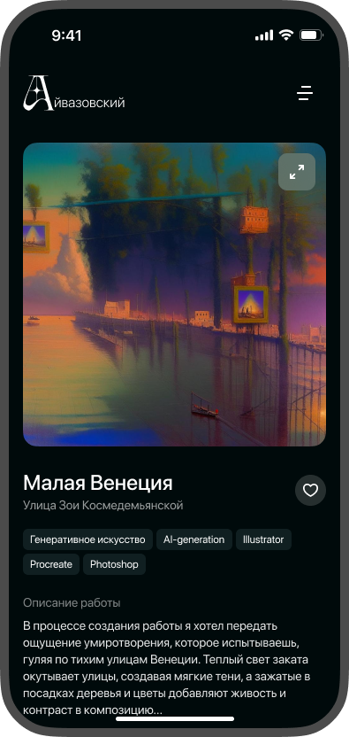
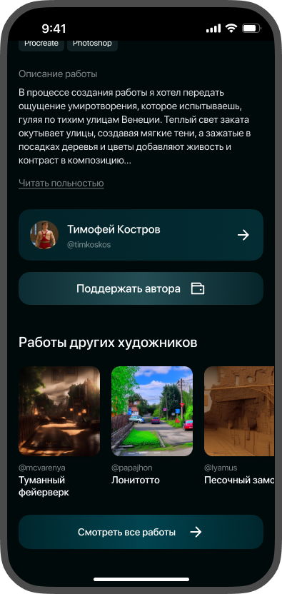
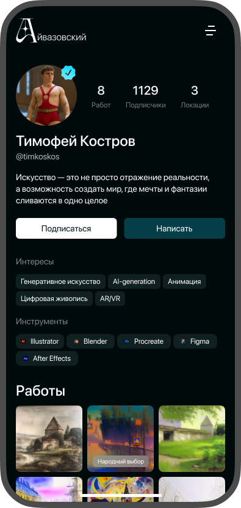
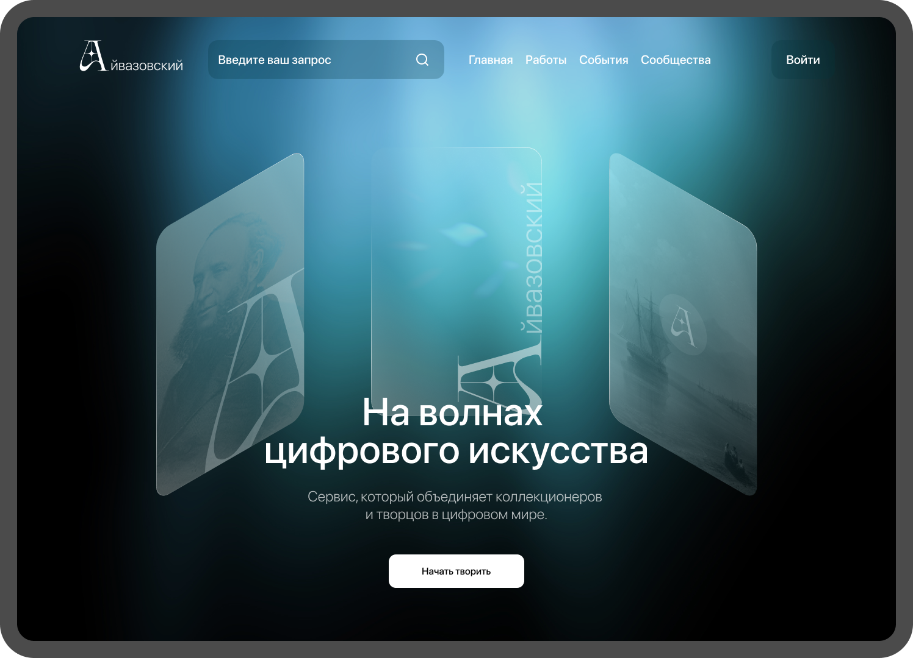
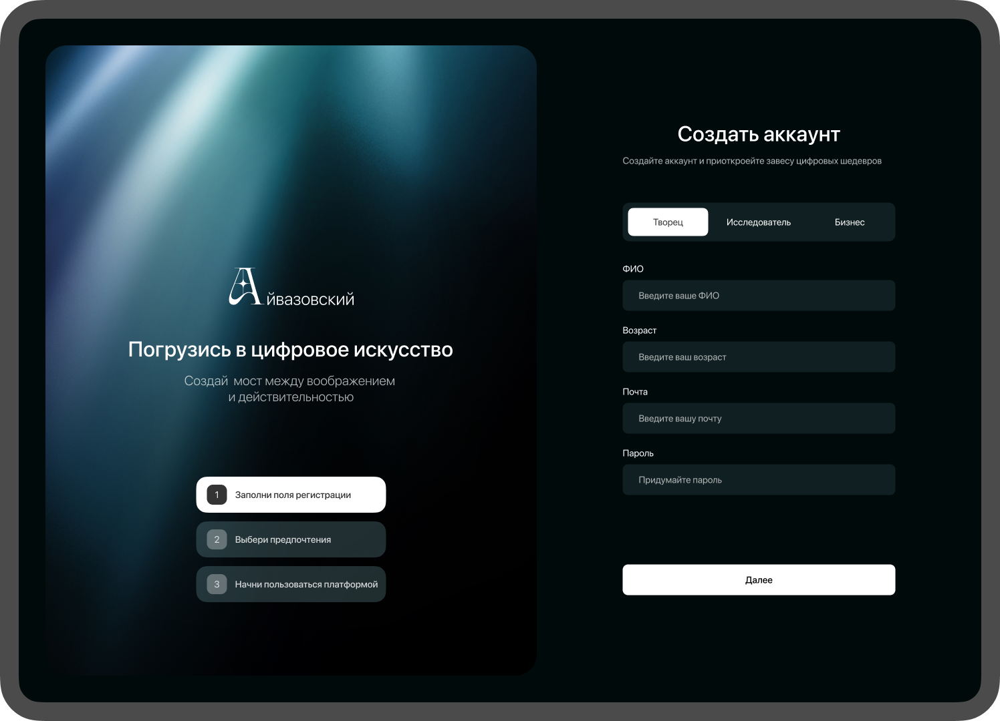

<br />
<div align="center">
    

  <h3 align="center">Айвазовский</h3>
  <h4>MISIS 52</h4>
  <p align="center">
    На волнах цифрового искусства!
</p>
</div>

<br>


<div align="center">
    
    
    
    
    
    
    
    
    
    
    
    
</div>

# 🚀  О Проекте 
Создание платформы и/или онлайн-инструмента, которая будет служить центром для продвижения цифрового искусства и креативной экономики в Смоленске.
Айвазовский — это платформа для цифрового искусства в Смоленске, объединяющая творчество и бизнес, с уникальными NFC-метками для оживления городских пространств.


## 🖼️ Превью

### Экраны мобильного приложения
<div style="display: grid; grid-template-columns: repeat(3, auto)">



</div>

### Экраны Desctop
<div style="display: grid; grid-template-columns: repeat(2, auto)">


</div>

## 📚 Установка 

### Требования 
На вашей машине должне быть установлен **docker compose**.

### Инструкция по установке и запуску 
Склонируйте проект к себе на устройство и перейдите в папку проекта  
```shell
git clone git@github.com:NikitaKrylov/Smolathon2.0.git
cd Smolathon2.0
```

Создайте и заполните .env файлы в указанных директориях
```shell
# ./db.env
POSTGRES_USER=<Пользователь БД>
POSTGRES_PASSWORD=<Пароль от БД>

# ./backend/app.env
DBUSER=<Пользователь БД>
DBPASSWORD=<Пароль БД>
DBHOST=<Хост БД>
DBNAME=<Имя БД>
DBPORT=<Порт по которому доступна БД>
MODE=<DEV, PROD>

# ./frontend/front.env
DOMAIN=<адрес сервера>
```

После чего можно запустить проект
```zsh
docker compose up --build -d
```

### Настройка CI / CD
Для работы автодеплоя в настройках репозитория на Github нужно настроить следующие параметры:
```shell
HOST=<Адрес сервера, на котором расположен проект>
PROJECT_DIR=<Рабочая директория проекта>
USERNAME=<Пользователь сервера(Linux)>
PASSWORD=<Пароль пользователя>
```


## 📋 Функционал

- [x] Деплой на сервер
- [x] Авторизация
- [x] Регистрация
- [x] Личный кабинет
- [x] Паспорт художника
- [x] Главная страница с подборкой 

- [ ] Публикации 
  - [x] Просмотр 
  - [x] Удаление
  - [ ] Создание/редактирование

- [ ] Ассистент 
  - [x] Генерация описания 
  - [x] Генерация изображений 
  - [x] Помощь в подборе мероприятий 
  - [ ] Генерация тегов по изображению
  - [ ] Помощь в продвижении 
- [ ] Статистика
  - [ ] Отслеживание лайков и просмотров
  - [ ] Аналитика  

## 🗨️ Состав команды 
[Крылов Никита](https://github.com/NikitaKrylov) - **Backend / DevOps**

[Ярослав Осокин](https://github.com/osyaros) - **Frontend**

[Андрей Кадомцев](https://github.com/Aven1r) - **ML / Promt Engineer**

[Андрей Тычинин](https://t.me/timkoskos) - **UI / UX / Frontend**

[Тимофей Костров](https://t.me/timkoskos) - **UI / UX / Frontend**
